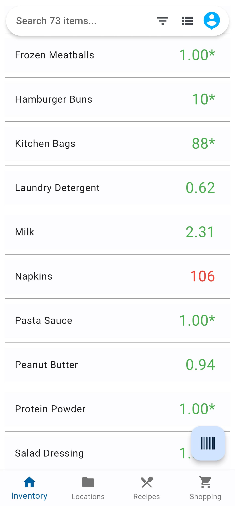
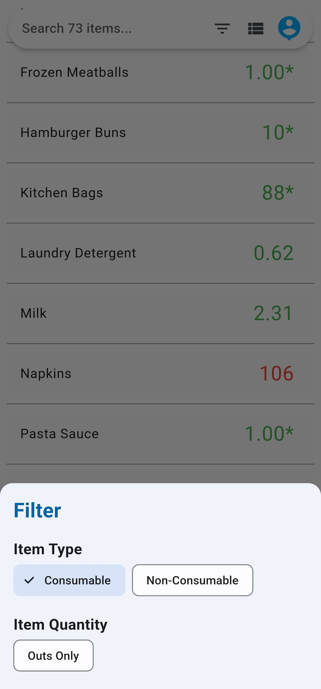
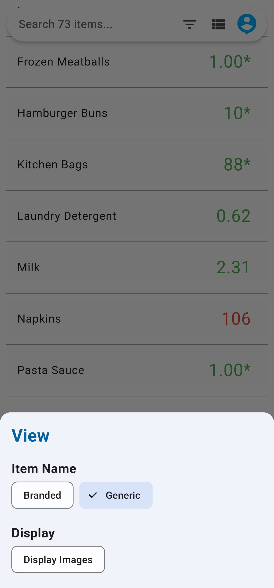
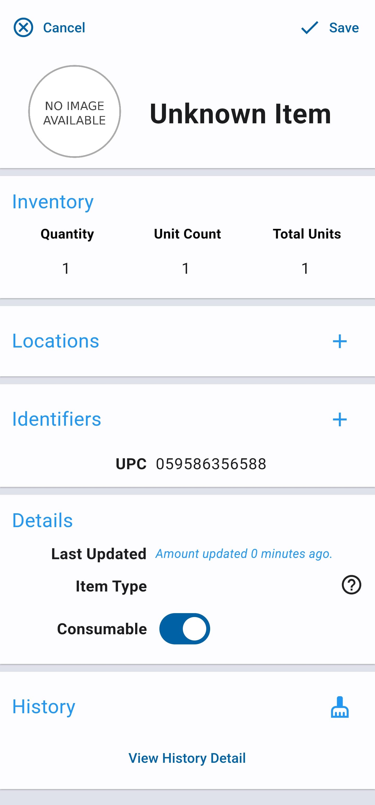
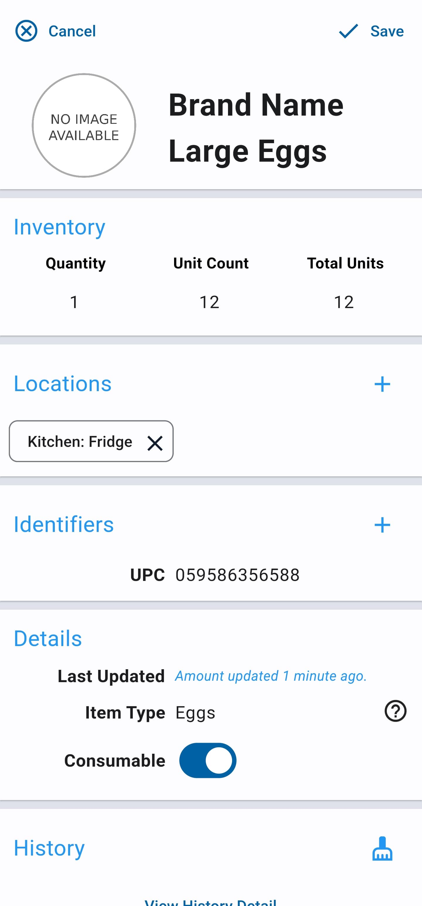
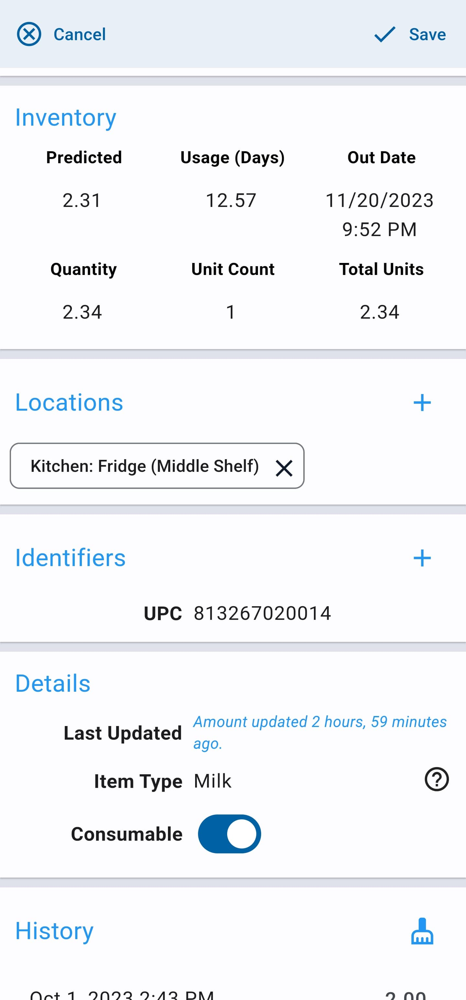

# Thingzee - Smart Home Inventory

## Overview

Thingzee is a smart home inventory system. It allows you to add items from your
home and track their location and quantity.

By periodically updating the quantity of items as you use them, a machine learning model
is able to predict the amounts of consumable items you own at any given time. As you add more data, it becomes more accurate.

It can use this data to generate automatic shopping lists so you never run out of the things you need.

## Status

Thingzee is in heavy development. Many things work, but some features are not fully implemented yet. It is recommended that you back up your data periodically using the export feature.

Cloud account signup is currently disabled due to rapid development changes. The app has a fully functional offline mode that can be used in the meantime.

## Usage

### Main Inventory View

The main inventory view shows all items in your inventory. You can add new items by pressing the "Barcode" floating action button in the bottom right corner. You can also search for items by name using the search bar. The search bar contains three buttons: a filter button, a view options button, and an account button.

| Inventory View      | Filter Options      | Display Options     |
|:-------------------:|:-------------------:|:-------------------:|
|  |  |  |

Quantities are displayed next to each item. If there is an asterisk next to an item, it means you have only added a single data point. A prediction cannot be made until more data is added.

Items can be swiped away to delete them. You can press on an item to
edit its details.

#### Unit Counts

Note that some items have a unit count set, and that the total units are displayed here. For example, a package of paper towels might have
six rolls within it. If you set the unit count correctly, the number on the right will refer to the total number of rolls you have (which is generally easier to manage), instead of the total number of packages.

If the unit count is not set, it will default to 1, and the number displayed on the right will be the total number of packages. This does not have to be a whole number; for example, if your laundry detergent quantity is 0.62, this means you have one package that is 62% full. If your milk quantity is 2.31, it means you have two full containers and another container that is 31% full.

#### Filter Options

- Item Type: Show items that are consumable, non-consumable, or both.
    Consumable items are things that you use up over time, like food or paper towels. Non-consumable items are things that you don't use up, like a TV or a couch.
- Item Quantity: Allows you to only show items that are out.

#### Display Options

- Item Name: Shows the full item name including the brand (the default), or a generic name for each item.
- Display: Shows images next to items (where available), or hides all images.

#### Account Options

You can access settings or log into your cloud account here.

In the settings menu, you can export all of your data to a zip file with all of your data in CSV format. You can also reimport this data later if you need to.

### Item Detail View

When creating a new item or editing an existing item, you are presented with the item detail view. For a new item, you can change the name and optionally add an image and item type.

| Item Detail (New)  | Item Detail (Data) | Item Detail (Pred) |
|:------------------:|:-----------------:|:------------------:|
|  |  |  |

#### Inventory

Here you can edit the quantity in your inventory. The quantity represents the total number of packages (can include decimals). The unit count represents the number of units within a single package. For example, this carton of eggs contains 12 eggs total. The total units represent the number of units in your inventory.

It's usually easier to update your inventory using a unit count, as changing this value will automatically update the package quantity.

Every time you change the quantity of an item, a new data point is added; the algorithm will start predicting the amount you have once you have at least two data points.

Note that data points are limited to one every 24 hours per item,
to avoid issues with the regression model being overly impacted by a single data point. You can still change the quantity of an item at any time, but if you have added a new data point within the last 24
hours it will update the last data point instead of adding a new one. You can also increase the number at any time (when you add new items to your inventory) and this will start a new regression model rather than negatively impacting the current one.

You can also see the "Usage (Days)" value, which is the total number
of days it takes for you to consume a single package of the given item.

Finally, you can see the "Out Date," which is the date that the item is predicted to run out.

The predicted amount, the usage rate, and the predicted out date are hidden until you have at least two data points.

#### Locations

Here you can add locations where the item is stored. You can browse all locations by using the "Locations" button at the bottom of the screen.

#### Identifiers

This is where you specify the UPC or EAN of the item.

#### Details

Here you can add additional details about the item, such as the item type, and whether or not it is consumable. Consumable items are things you use up over time, like food, whereas non-consumable items are things you don't use up, like a computer.

#### History

Displays a record of all data points added for the item. You can also delete erroneous data here.
